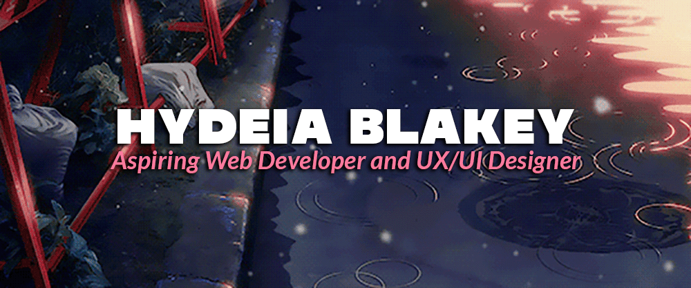

<!--
Banner Section
-->

<!--
Mini Introduction
-->

Hey! I'm Hydeia, a *shy* **NYC native** that loves to find different ways to express her creativity. Experience the journey with me!

----
<!--
Technologies
-->

 

---

<a href="mailto:blakeyhydeia@gmail.com"> 

<a href="https://www.linkedin.com/in/hydeiablakey/" target="_blank">

